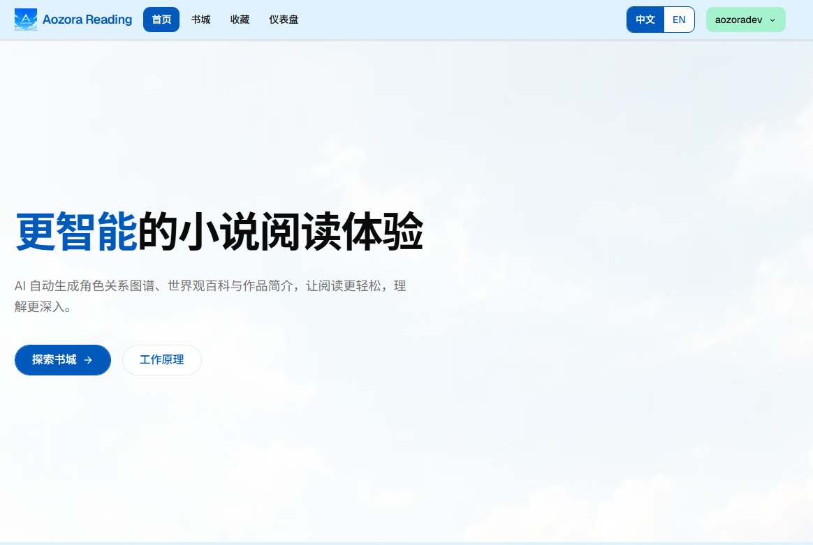
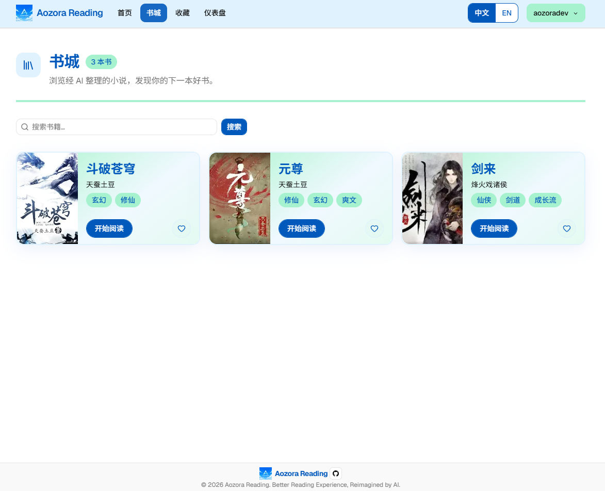
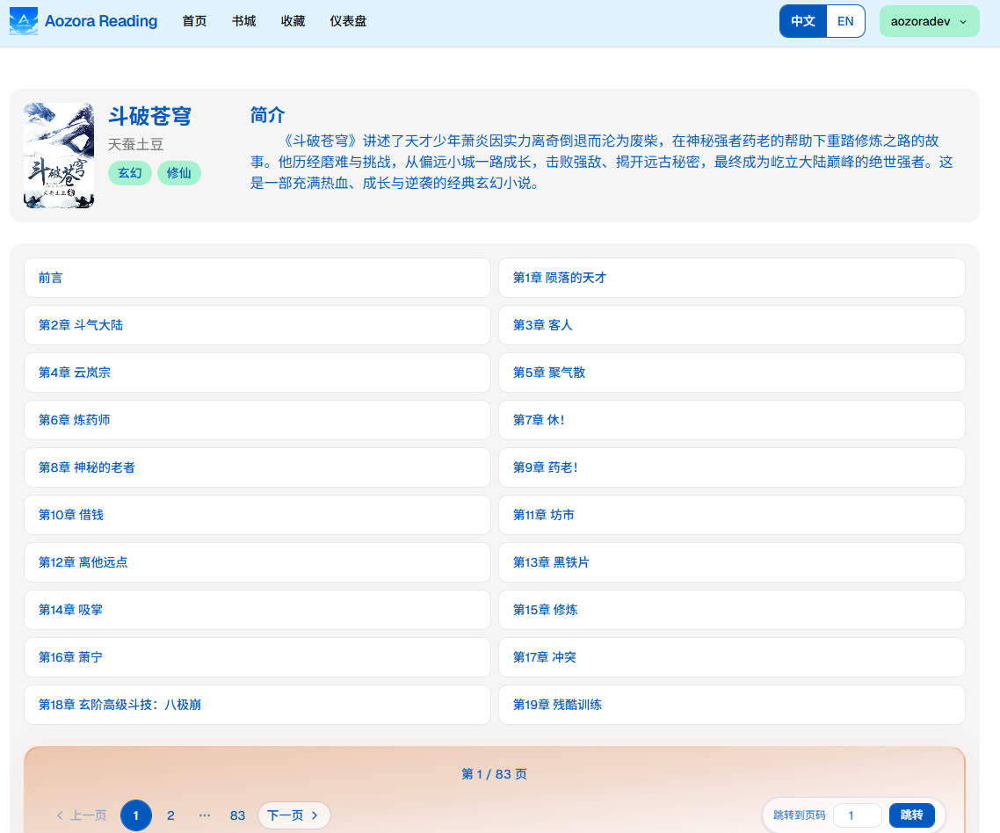

<div align="center">


# AozoraReading

**AI-powered novel reading platform**

Automatically organizes chapter structure, generates character relationship graphs, world-building encyclopedias, and work summaries — making long-form reading easier and deeper to understand.

<br />

[](https://nextjs.org/)
[](https://react.dev/)
[](https://www.typescriptlang.org/)
[](https://supabase.com/)
[](https://tailwindcss.com/)
[](LICENSE)

[中文](README.md) · [Quick Start](#quick-start) · [Features](#features) · [Tech Stack](#tech-stack) · [Open Source](#open-source)

</div>

---

## Preview

<table>
  <tr>
    <td align="center" width="33%">
      
      <br /><sub><b>Home</b></sub>
    </td>
    <td align="center" width="33%">
      
      <br /><sub><b>Library</b></sub>
    </td>
    <td align="center" width="33%">
      
      <br /><sub><b>Reading</b></sub>
    </td>
  </tr>
</table>

---

## Features

<table>
  <tr>
    <td width="50%" valign="top">

**📚 Reading Experience**
- Browse and search the library
- Chapter reading with progress and favorites
- Chinese/English toggle, light/dark themes

</td>
    <td width="50%" valign="top">

**⚙️ Content Management**
- Dashboard for managing novels
- Upload covers, batch import `.txt` chapters
- Email sign-up/login with OTP verification

</td>
  </tr>
</table>

---

## Tech Stack

<table>
  <tr>
    <th>Category</th>
    <th>Technologies</th>
  </tr>
  <tr>
    <td><b>Framework</b></td>
    <td><a href="https://nextjs.org/">Next.js 16</a> (App Router) + <a href="https://react.dev/">React 19</a></td>
  </tr>
  <tr>
    <td><b>Language</b></td>
    <td><a href="https://www.typescriptlang.org/">TypeScript</a></td>
  </tr>
  <tr>
    <td><b>UI / Styling</b></td>
    <td><a href="https://tailwindcss.com/">Tailwind CSS 4</a> · <a href="https://www.radix-ui.com/">Radix UI</a> · <a href="https://ui.shadcn.com/">shadcn/ui</a> · <a href="https://github.com/pacocoursey/next-themes">next-themes</a></td>
  </tr>
  <tr>
    <td><b>Backend / Data</b></td>
    <td><a href="https://supabase.com/">Supabase</a> (Auth, PostgreSQL, Storage)</td>
  </tr>
  <tr>
    <td><b>Forms</b></td>
    <td><a href="https://react-hook-form.com/">React Hook Form</a> + <a href="https://zod.dev/">Zod</a></td>
  </tr>
  <tr>
    <td><b>i18n</b></td>
    <td><a href="https://next-intl.dev/">next-intl</a></td>
  </tr>
  <tr>
    <td><b>Other</b></td>
    <td>react-markdown · sonner · lucide-react</td>
  </tr>
</table>

---

## Project Structure

```
app/                    # Next.js App Router pages and routes
  library/              # Library
  reading/              # Reading page
  favorites/            # Favorites
  text/                 # Chapter content
  dashboard/            # Admin dashboard (overview, add novel, add chapters)
  login/ signup/ forget/ # Authentication
components/             # Reusable UI and business components
lib/supabase/           # Supabase client and data access layer
messages/               # i18n strings (zh.json / en.json)
i18n/                   # i18n configuration
public/markdown/        # Static Markdown content (e.g. "How it works")
```

---

## Quick Start

### Requirements

- Node.js 20+
- [pnpm](https://pnpm.io/) (recommended) or npm / yarn
- A Supabase project

### 1. Clone and install dependencies

```bash
git clone https://github.com/AozoraDev/AozoraReading.git
cd AozoraReading
pnpm install
```

### 2. Configure environment variables

Copy `.env.example` to `.env.local` and fill in your Supabase project details (from [Supabase Dashboard → Settings → API](https://supabase.com/dashboard/project/_/settings/api)):

```env
NEXT_PUBLIC_SUPABASE_URL=https://your-project-id.supabase.co
NEXT_PUBLIC_SUPABASE_ANON_KEY=your-anon-key
SUPABASE_SERVICE_ROLE_KEY=your-service-role-key
```

> `SUPABASE_SERVICE_ROLE_KEY` is for server-side operations only (e.g. dashboard cover uploads, Storage management). Do not expose it to the client.

### 3. Start the development server

```bash
pnpm dev
```

Open [http://localhost:3000](http://localhost:3000) in your browser.

### Other commands

| Command | Description |
|---------|-------------|
| `pnpm build` | Production build |
| `pnpm start` | Start production server |
| `pnpm lint` | ESLint check |
| `pnpm typecheck` | TypeScript type check |
| `pnpm format` | Prettier formatting |

---

## Open Source

This project is open source under the [MIT License](LICENSE). It provides the reading platform code only — **no novel content is included**.

| | |
|---|---|
| **Bring your own novels** | Prepare, upload, and manage novel text and covers yourself, and ensure you have the appropriate copyright or authorization |
| **Bring your own backend** | Create your own [Supabase](https://supabase.com/) project, configure the database, Storage, and Auth, and fill in `.env.local` |

Like other open-source reading tools, this project open-sources the software itself; content and backend infrastructure are the user's responsibility.

---

<div align="center">

<sub>Maintained by <a href="https://github.com/AozoraDev">AozoraDev</a></sub>

</div>
